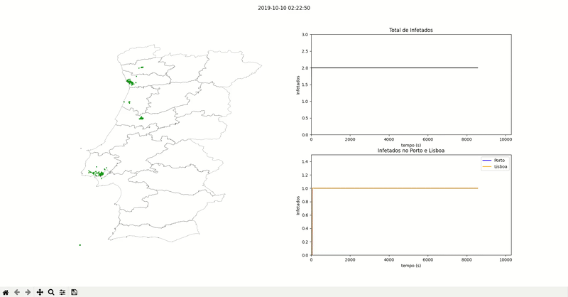
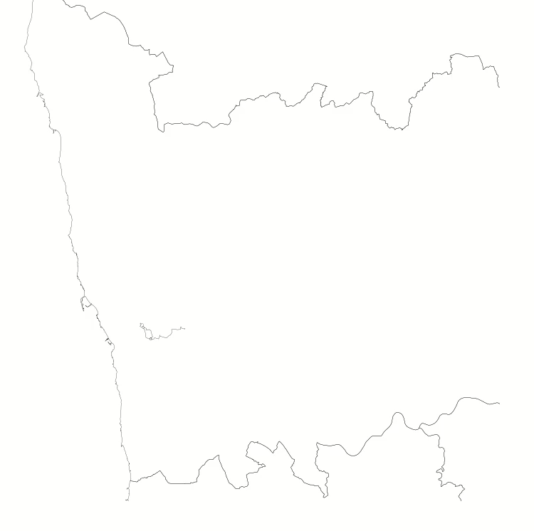

**Visualização**

Desenhos das posições dos taxis

Desenho dos trajetos dos taxis infetados

Versão Final

**Requesitos**

* Instalar postgres/postgis
* Importar as bases de dados fornecidas nas aulas 

> https://drive.google.com/drive/folders/1eL788tUr2IOqCiwtpoyGLDJ4_YQh0mnK?usp=sharing

* Instalar as seguintes dependencias:

    * psycopg2
    * numpy
    * argparse
    * matplotlib
    * csv
    * random
    * postgis
    * pandas  
    * datetime

**Execução**

Para ver os comandos disponiveis 

> python3 main.py -h

**Descrição dos ficheiros**

- lenState --> nº de infetados por ts
- offsets3 --> posição de cada taxis por ts
- sizeState --> tamanho de cada taxi por ts
- taxis_inf --> id dos taxis infetados por ts
- tracks_inf --> trajeto dos taxis infetados por ts
- virusState --> estado de infeção de cada taxi por ts ( 1 = infetado)
- distrito_inf -> numero de infetados no porto, lisboa por ts
